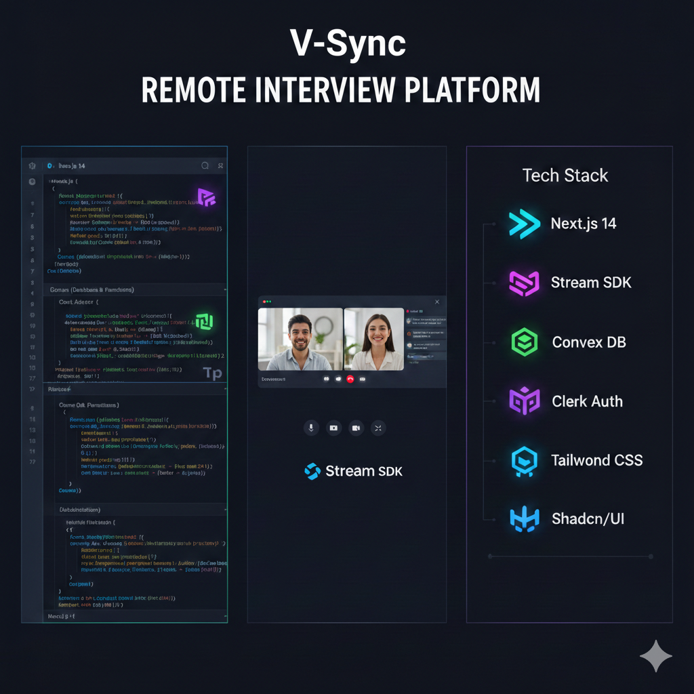

# 

# V-Sync
### *A high-performance Remote Technical Interview Platform.*

** Live Demo:** [vedio-sync.netlify.app](https://vedio-sync.netlify.app/)

####  Interviewer Access (Demo)
- **Email:** `interviewer112233@gmail.com`
- **Password:** `interviewer@123`

[](https://vedio-sync.netlify.app/)
[](https://nextjs.org/)
[](https://www.convex.dev/)
[](https://clerk.com/)

---

## Bridging the Gap
**V-Sync** is engineered to transform the remote hiring experience. Our core vision is to bridge the gap between interviewers and candidates with seamless video interaction, real-time code synchronization, and integrated feedback loops. No more context-switching between tools—everything you need for a professional technical assessment in one unified interface.

---

## Why V-Sync?
In today's remote-first world, technical interviews often suffer from laggy screen sharing and disconnected code editors. **V-Sync** solves this by:
- **Reducing Friction**: Instant meeting setup and join flows.
- **Boosting Collaboration**: Real-time sync that feels like local development.
- **Optimizing Focus**: Resizable layouts that let you prioritize what matters.
- **Ensuring Reliability**: Built on top of enterprise-grade infrastructure.

---

## Tech Stack

| Layer | Technology |
| :--- | :--- |
| **Framework** | [Next.js (App Router)](https://nextjs.org/) |
| **Video & Audio** | [Stream SDK](https://getstream.io/video/) |
| **Backend & DB** | [Convex](https://www.convex.dev/) |
| **Authentication** | [Clerk](https://clerk.com/) |
| **Styling** | [Tailwind CSS](https://tailwindcss.com/) & [Shadcn/UI](https://ui.shadcn.com/) |

---

## Key Features

-  **Real-time Collaborative Code Editor**: Multi-user synchronization with syntax highlighting.
-  **High-fidelity Conferencing**: Crystal clear video and audio powered by Stream SDK.
-  **Resizable Layouts**: Flexible UI for multi-tasking and optimal workspace management.
-  **Candidate Dashboard**: Streamlined management for interviewers to track sessions.
-  **Secure Meeting Setup**: Pre-flight device testing for audio and video before joining.

---

## 📂 Project Structure

```text
V-Sync/
├── src/
│   ├── app/            # Next.js App Router routes
│   ├── components/     # UI components (home, interview, meetings, ui)
│   ├── providers/      # Context and Service providers (Clerk, Convex, Stream)
│   ├── hooks/          # Custom react hooks
│   ├── actions/        # Server actions for business logic
│   ├── constants/      # Shared constants and configuration
│   └── lib/            # Utility functions
├── convex/             # Database schemas and server-side functions
├── public/             # Static assets (images, icons)
└── tsconfig.json       # TypeScript configuration with path aliases
```

---

## Getting Started

### Prerequisites
- Node.js 18+ 
- npm / yarn / pnpm

### 1. Clone the repository
```bash
git clone https://github.com/ibrahimabdullaziz/remote-interview-platform.git
cd remote-interview-platform
```

### 2. Install dependencies
```bash
npm install
```

### 3. Environment Setup
Create a `.env.local` file in the root directory and add your credentials:

```env
# Clerk Authentication
NEXT_PUBLIC_CLERK_PUBLISHABLE_KEY=your_publishable_key
CLERK_SECRET_KEY=your_secret_key
CLERK_JWT_ISSUER_DOMAIN=your_clerk_domain

# Convex Backend
CONVEX_DEPLOYMENT=your_deployment_id
NEXT_PUBLIC_CONVEX_URL=your_convex_url

# Stream SDK
NEXT_PUBLIC_STREAM_API_KEY=your_stream_key
STREAM_SECRET_KEY=your_stream_secret
```

### 4. Run Development Server
```bash
npm run dev
```
Visit `http://localhost:3000` to see V-Sync in action.

---

## Screenshots & Walkthrough

*(Upload your screenshots to `/public` and link them here to showcase your beautiful UI!)*

---

## Contributing
Contributions are welcome! Please feel free to submit a Pull Request.

---

<p align="center">
  Developed with ❤️ by <a href="https://github.com/ibrahimabdullaziz">Ibrahim Abdullaziz</a>
</p>
